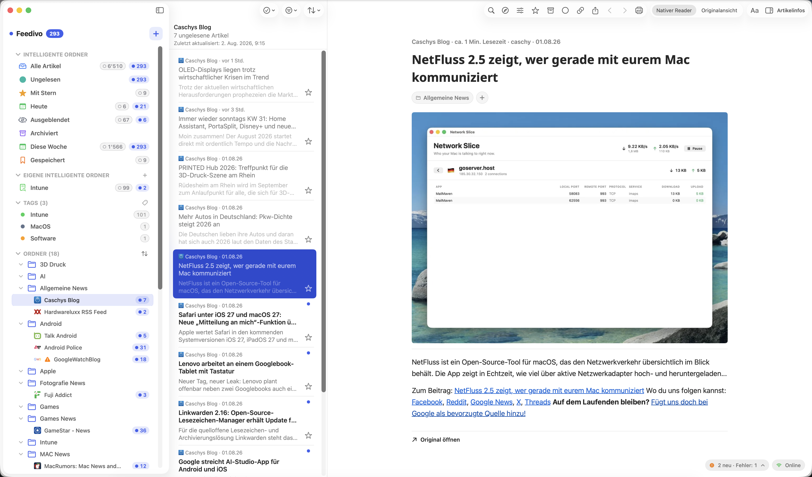
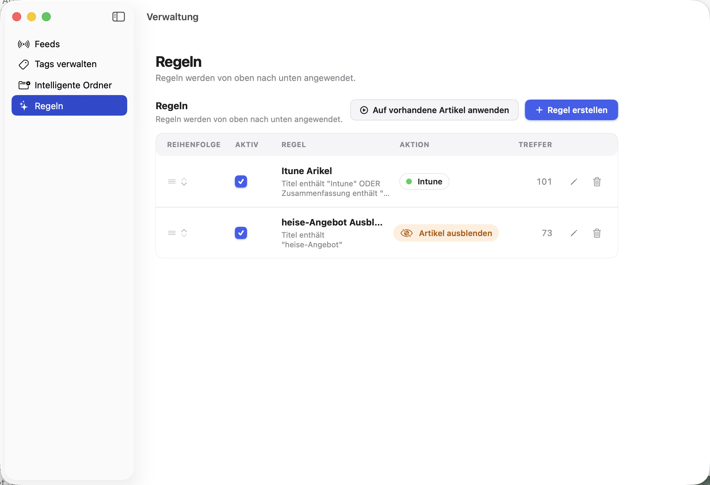
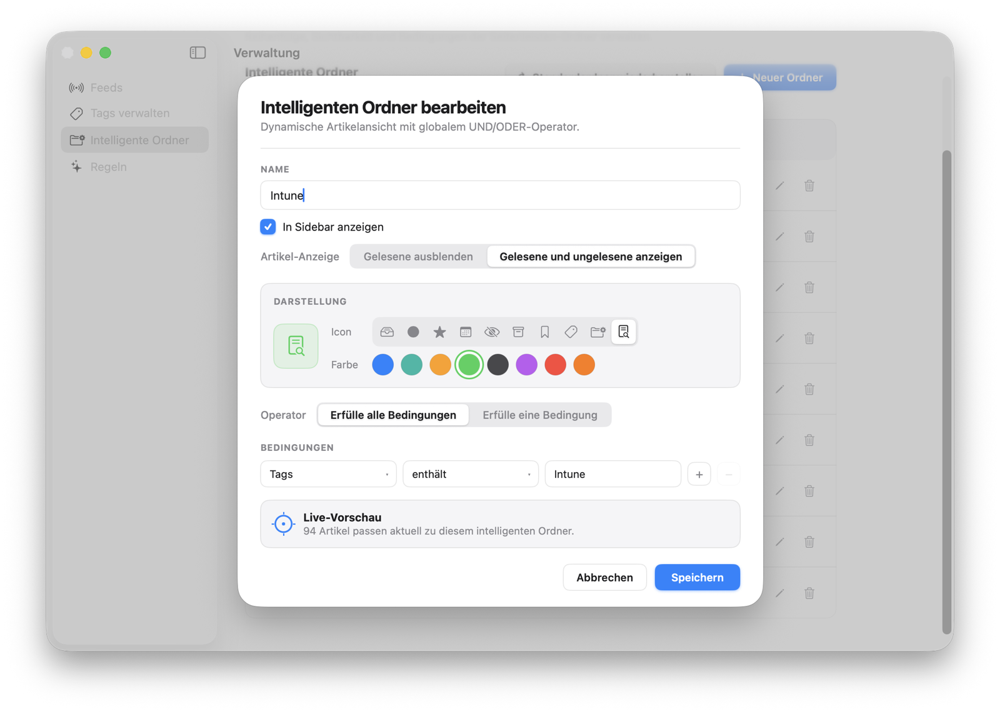
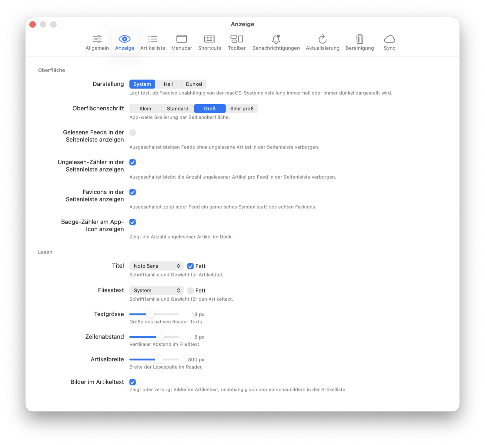

# Feedivo

Ein nativer RSS-Reader für macOS — schnell, „mac-like" und ohne Electron oder
iOS-Portierung. Echtes AppKit-Feeling via SwiftUI, mit Tags, automatischen
Regeln, intelligenten Ordnern und OPML-Import/-Export.

> Privates Solo-Projekt in aktiver Entwicklung.

## Screenshots


*3-Spalten-Navigation mit Ordnern, Tags und intelligenten Ordnern in der Sidebar, Artikelliste in der Mitte, nativer Reader rechts.*

<table>
<tr>
<td width="50%">


*Regel-Editor (Power-User-Modus) — verschachtelte UND/ODER-Bedingungsgruppen weisen automatisch Tags zu, blenden Artikel aus oder lösen Benachrichtigungen aus.*

</td>
<td width="50%">


*Intelligenter Ordner mit eigenem Bedingungs-Editor, Icon/Farbwahl und Live-Vorschau der Trefferzahl.*

</td>
</tr>
</table>


*Einstellungen → Anzeige — App-weite Textgröße, Hell/Dunkel/System, Schriftarten und Layout-Feinschliff für den Reader.*

## Features

- **3-Spalten-Navigation** (Sidebar / Artikelliste / Reader) via
  `NavigationSplitView`, plus separate Fenster für Suche, Feed-/Ordner-
  Verwaltung ("Organizer") und Artikel-Popouts
- **Tags & automatische Regeln** — Artikel per Regelwerk taggen, ausblenden
  oder benachrichtigen lassen
- **Intelligente Ordner** (Smart Folders) mit eigenem Bedingungs-Editor,
  inkl. UND/ODER-Gruppierung
- **OPML-Import/-Export** mit Vorschau, Review-Screen und Duplikat-Erkennung
- **Artikel-Reader** wahlweise nativ (SwiftUI, inkl. Fett/Kursiv/Links/Farben
  aus dem Artikel-HTML) oder als Original-Ansicht (WKWebView)
- **Artikel-Export** nach Markdown, PDF, DOCX oder als Paket
- **Automatische Aufbewahrungsrichtlinien** (global + pro Feed) mit
  konfigurierbarem Zeitplan und Verlaufs-Historie
- **Hintergrund-Refresh** über `NSBackgroundActivityScheduler`
- **Browser-Erweiterungen** für Safari und Chrome zum Erkennen und
  Hinzufügen von Feeds direkt aus dem Browser
- **Menüleisten-Icon** mit Ungelesen-Badge und Artikel-Dropdown
- **iCloud Sync (Beta)** über `CKSyncEngine` — Tags, Feeds, Ordner, Regeln,
  benutzerdefinierte Intelligente Ordner und Artikelstatus (Gelesen/Stern)
  inkl. Feld-Ebene-Konfliktauflösung; noch nicht abschließend gehärtet
  (siehe [`CLAUDE.md`](CLAUDE.md))
- **Automatische Updates** über [Sparkle](https://sparkle-project.org) —
  Developer-ID-signierte, notarisierte Releases, In-App-Prüfung + Installation
  ohne Umweg über den App Store (bei Installation via Homebrew läuft das
  Update stattdessen über `brew upgrade`, siehe Installation unten)
- Vollständig lokalisiert (Deutsch/Englisch)

## Installation

### Über Homebrew (empfohlen)

```bash
brew tap martinfelder/feedivo
brew install --cask feedivo
```

Updates laufen bei einer Homebrew-Installation ausschließlich über
`brew upgrade --cask feedivo` — die App erkennt das automatisch und
deaktiviert dafür die eingebaute Sparkle-Update-Prüfung.

### Manueller Download

Aktuelle, signierte und notarisierte Releases stehen unter
[GitHub Releases](https://github.com/martinfelder/feedivo-mac/releases) zum
direkten Download bereit (`.zip`, entpacken und in den Programme-Ordner
ziehen). Diese Variante prüft und installiert Updates automatisch über
Sparkle (Menü „Feedivo" → „Nach Updates suchen…", zusätzlich ein
automatischer Hintergrund-Check).

## Tech-Stack

| Bereich | Technologie |
|---|---|
| UI | SwiftUI (macOS), punktuell `NSViewRepresentable` (z. B. `WKWebView`, Sidebar via `NSOutlineView`) |
| Architektur | MVVM mit `@Observable` |
| Persistenz | [GRDB](https://github.com/groue/GRDB.swift) (SQLite) — eigene Datenschicht, kein SwiftData/Core Data |
| RSS-Parsing | [FeedKit](https://github.com/nmdias/FeedKit) |
| Netzwerk | `URLSession` + async/await |
| iCloud Sync | `CKSyncEngine` (CloudKit) |
| Mindest-macOS | macOS 14 Sonoma |

Details zu Architektur-Entscheidungen und Datenbank-Migrationen stehen in
[`CLAUDE.md`](CLAUDE.md).

## Projekt öffnen

```bash
open Feedivo.xcodeproj
```

Xcode löst die Swift-Package-Abhängigkeiten (GRDB, FeedKit) automatisch auf.
Build & Run über das Schema `Feedivo`.

### Tests

Die volle Testsuite kann in dieser Umgebung hängen bleiben — gezielt mit
`-only-testing:` und `-parallel-testing-enabled NO` ausführen, z. B.:

```bash
xcodebuild -scheme Feedivo -destination 'platform=macOS' test \
  -only-testing:FeedivoTests/FeedStoreTests \
  -parallel-testing-enabled NO
```

## Versionierung & Releases

Die Marketing-Version steht fest bei `1.0`; die **Build-Nummer** wird nur auf
expliziten Wunsch manuell hochgezählt:

```bash
bash scripts/bump_version.sh
```

(Kein automatischer Hook mehr bei jedem Push — dadurch können mehrere Pushes
unter derselben Build-Nummer gesammelt werden.) Jeder Bump ergänzt
gleichzeitig einen Eintrag in [`CHANGELOG.md`](CHANGELOG.md) mit den seit dem
letzten Bump gepushten Commit-Nachrichten.

Ein kompilierter Release wird **nie automatisch** hochgeladen — nur auf
expliziten Wunsch, per:

```bash
bash scripts/create_github_release.sh
```

Das Skript baut über `xcodebuild archive` + `-exportArchive`
(`method: developer-id`), signiert die `.app` mit dem "Developer ID
Application"-Zertifikat, reicht sie bei Apple zur Notarisierung ein und
heftet das Ticket an (`stapler staple`) — das Ergebnis läuft ohne
Gatekeeper-Warnung auf jedem Mac. Anschließend liest es den obersten Eintrag
aus `CHANGELOG.md` als Release-Notes, veröffentlicht über die `gh` CLI ein
GitHub Release (Tag `v<Version>-<Build>`), signiert das Release-Zip für
Sparkle (EdDSA) und pflegt `docs/appcast.xml` sowie die Homebrew-Cask-Formel
im [Tap-Repo](https://github.com/martinfelder/homebrew-feedivo) nach —
jeweils nach interaktiver Bestätigung. Voraussetzungen: `gh` CLI eingeloggt,
ein "Developer ID Application"-Zertifikat im Schlüsselbund sowie ein
App-Store-Connect-API-Key unter
`~/.appstoreconnect/private_keys/AuthKey_<KeyID>.p8` für die Notarisierung
(Details siehe [`CLAUDE.md`](CLAUDE.md)).

## Lizenz

Privates Projekt, kein öffentliches Lizenzmodell.
